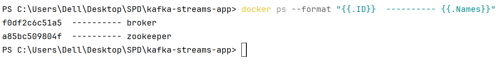

# Practical Activity N°3 - Event Driven Architecture with KAFKA

## Purpose

In this practical activity we learn how to implement an `Event Driven Architecture` with Kafka broker,
in this activity we try to:
- `produce` messages with `StreamBridge` class based on http request.
- `Consume` events or messages with functional approach.
- `Generate` and produce records periodically.
- `Process` (consume and produce) records.
- `Real time processing` using `Kafka Streams`


### Run Kafka in local, and test with kafka console producer and consumer

after downloading kafka binary files from [kafka web site](https://kafka.apache.org/downloads)
the next step is unzipping zip file and move `kafka` directory to `C:\\`:


the next step is to start zookeeper instance (because kafka use zookeeper to coordinate brokers) :


and we are ready to start kafka instance:


the next step is to create a `Topic` let's name it `topic1`:


now we can start a `kafka-console-consumer` on that topic `topic1`


after that we can start `kafka-console-producer` to produce some messages:


and in consumer side:


### Run Kafka cluster using Docker

To run kafka cluster in `docker containers` we create first `docker-compose.yml` file,

```yaml

version: '3.8'
services:
  zookeeper:
    image: confluentinc/cp-zookeeper:7.7.1
    container_name: zookeeper
    hostname: zookeeper
    environment:
      ZOOKEEPER_CLIENT_PORT: 2181
      ZOOKEEPER_TICK_TIME: 2000
    ports:
      - 22181:2181
    networks:
      - kafka-net
  
  broker:
    image: confluentinc/cp-kafka:7.7.1
    container_name: broker
    hostname: broker
    depends_on:
      - zookeeper
    ports:
      - 9092:29092
    environment:
      KAFKA_BROKER_ID: 0
      KAFKA_ZOOKEEPER_CONNECT: zookeeper:2181
      KAFKA_LISTENERS: INTERNAL://:9093,EXTERNAL_SAME_HOST://:29092
      KAFKA_ADVERTISED_LISTENERS: INTERNAL://broker:9093,EXTERNAL_SAME_HOST://localhost:9092
      KAFKA_LISTENER_SECURITY_PROTOCOL_MAP: INTERNAL:PLAINTEXT,EXTERNAL_SAME_HOST:PLAINTEXT
      KAFKA_INTER_BROKER_LISTENER_NAME: INTERNAL
      KAFKA_OFFSETS_TOPIC_REPLICATION_FACTOR: 1
    
    networks:
      - kafka-net


networks:
  kafka-net:
    driver: bridge
```

here we create `kafka-cluster` including one instance of `zookeeper` and one instance `kafka-broker`, so
we have 2 containers:





#### testing with kafka console (consumer and producer)


### Create spring boot app 

in this section, our produced and consumed records is objects of type `PageEvent`.

#### PageEvent Record

```java
package md.hajji.springkafkastreams.records;

import java.time.LocalDateTime;

public record PageEvent(
        String name,
        String username,
        LocalDateTime timestamp,
        Long duration
) {
}

```

#### PageEventFactory class

As the name of class indicate, in order to simplify creation of PageEvent instances and avoiding
code duplicates:

```java
public class PageEventFactory {

    // random instance:
    private static final Random random = new Random();
    // user list:
    private static final List<String> USERS =
            List.of("Mohammed", "Hassan", "Mouad", "Souhail", "Taha", "Chaimae", "Meryem");

    // page list:
    private static final List<String> PAGES =
            List.of("costumers", "products", "categories", "orders", "bills");

    /**
     * Create a new pageEvent instance, with appropriate name
     * @param name: page name
     * @return PageEvent instance
     */
    public static PageEvent of(String name){
        // get a random index [0, User list size];
        int userIndex = random.nextInt(USERS.size());
        // create and return a PageEvent instance:
        return new PageEvent(
                name,
                USERS.get(userIndex),
                LocalDateTime.now(),
                random.nextLong(1000, 8000)
        );
    }

    /**
     * generate new page randomly
     * @return PageEvent instance
     */

    public static PageEvent get(){
        int pageIndex = random.nextInt(PAGES.size());
        return of(PAGES.get(pageIndex));
    }

    /**
     * generate a new pageEvent from another
     * @param other: pageEvent to clone
     * @return newPageEvent
     */
    public static PageEvent from(PageEvent other){
        return new PageEvent(
                "/" + other.name(),
                other.username(),
                other.timestamp(),
                other.duration()
        );
    }
}

```
 and to test our class `PageEventFactory` we create a bean of `CommandLineRunner` and generate
 10 pageEvent objects:
 
```java
  @Bean
    CommandLineRunner start(){
        return args -> {
            Stream.generate(PageEventFactory::get)
                    .limit(10)
                    .forEach(System.out::println);
        };
    }
```

we got the following results at application startup:

