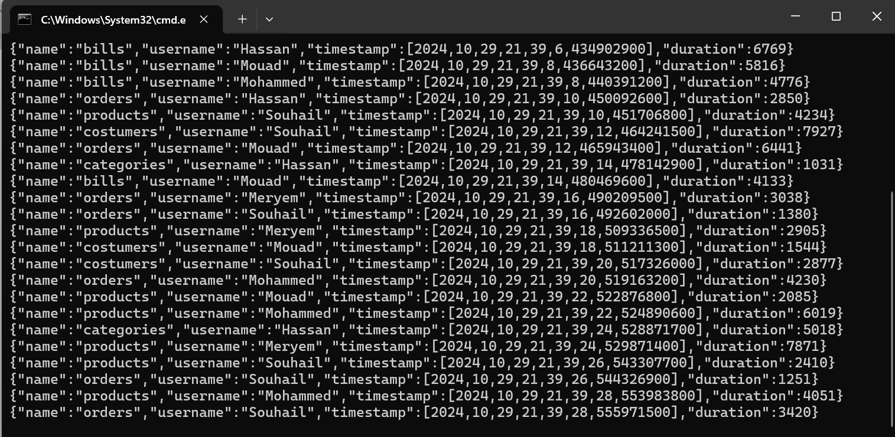

# Practical Activity N°3 - Event Driven Architecture with KAFKA

## Purpose

In this practical activity we learn how to implement an `Event Driven Architecture` with Kafka broker,
in this activity we try to:
- `produce` messages with `StreamBridge` class based on http request.
- `Consume` events or messages with functional approach.
- `Generate` and produce records periodically.
- `Process` (consume and produce) records.
- `Real time processing` using `Kafka Streams`


### Run Kafka in local, and test with kafka console producer and consumer

after downloading kafka binary files from [kafka web site](https://kafka.apache.org/downloads)
the next step is unzipping zip file and move `kafka` directory to `C:\\`:


the next step is to start zookeeper instance (because kafka use zookeeper to coordinate brokers) :


and we are ready to start kafka instance:


the next step is to create a `Topic` let's name it `topic1`:


now we can start a `kafka-console-consumer` on that topic `topic1`


after that we can start `kafka-console-producer` to produce some messages:


and in consumer side:


### Run Kafka cluster using Docker

To run kafka cluster in `docker containers` we create first `docker-compose.yml` file,

```yaml

version: '3.8'
services:
  zookeeper:
    image: confluentinc/cp-zookeeper:7.7.1
    container_name: zookeeper
    hostname: zookeeper
    environment:
      ZOOKEEPER_CLIENT_PORT: 2181
      ZOOKEEPER_TICK_TIME: 2000
    ports:
      - 22181:2181
    networks:
      - kafka-net
  
  broker:
    image: confluentinc/cp-kafka:7.7.1
    container_name: broker
    hostname: broker
    depends_on:
      - zookeeper
    ports:
      - 9092:29092
    environment:
      KAFKA_BROKER_ID: 0
      KAFKA_ZOOKEEPER_CONNECT: zookeeper:2181
      KAFKA_LISTENERS: INTERNAL://:9093,EXTERNAL_SAME_HOST://:29092
      KAFKA_ADVERTISED_LISTENERS: INTERNAL://broker:9093,EXTERNAL_SAME_HOST://localhost:9092
      KAFKA_LISTENER_SECURITY_PROTOCOL_MAP: INTERNAL:PLAINTEXT,EXTERNAL_SAME_HOST:PLAINTEXT
      KAFKA_INTER_BROKER_LISTENER_NAME: INTERNAL
      KAFKA_OFFSETS_TOPIC_REPLICATION_FACTOR: 1
    
    networks:
      - kafka-net


networks:
  kafka-net:
    driver: bridge
```

here we create `kafka-cluster` including one instance of `zookeeper` and one instance `kafka-broker`, so
we have 2 containers:


#### testing with kafka console (consumer and producer)


### Create spring boot app 

#### Application configuration

in our spring boot application and for different use cases that will be trait, we use the following 
configurations:

```yaml
spring:
  # specify the application name:
  application:
    name: spring-kafka-streams

  cloud:
    stream:
      # binding consumers, producers, transformers to specific Topic
      # by defining message channels and
      # their input(read source) topic
      # their output(write destination) topic
      bindings:

        # T1 -----<Channel>----> pageEventConsumer
        pageEventConsumer-in-0:
          destination: T1

        # pageEventSupplier -----<Channel>----> T2
        pageEventSupplier-out-0:
          destination: T2

        # T2 -----<Channel>----> pageEventFunction
        pageEventFunction-in-0:
          destination: T2
        # pageEventFunction -----<Channel>----> T3
        pageEventFunction-out-0:
          destination: T3

        # T2 -----<Channel>----> kStreamFunction
        kStreamFunction-in-0:
          destination: T2

        # kStreamFunction -----<Channel>----> T4
        kStreamFunction-out-0:
          destination: T4

    # let spring cloud streams recognize our
    # beans as kafka subscriber/publisher:
    function:
      definition: pageEventConsumer; pageEventSupplier;pageEventFunction;kStreamFunction

  integration:
    # setting poller (suppliers):
    poller:
      # waiting delay before start producing:
      initial-delay: 5000
      # produce rate (for each 3 seconds):
      fixed-delay: 3000
      # records quantity that will be produced every time:
      max-messages-per-poll: 2

  kafka:
    streams:
      properties:
        # interval time that kafka should flush state store
        # and persist results in destination KTable
        commit.interval.ms: 100


```

later will explain every property for right time.

also in this section, our produced and consumed records is objects of type `PageEvent`.

#### PageEvent Record

```java
package md.hajji.springkafkastreams.records;

import java.time.LocalDateTime;

public record PageEvent(
        String name,
        String username,
        LocalDateTime timestamp,
        Long duration
) {
}

```

#### PageEventFactory class

As the name of class indicate, in order to simplify creation of PageEvent instances and avoiding
code duplicates:

```java
public class PageEventFactory {

    // random instance:
    private static final Random random = new Random();
    // user list:
    private static final List<String> USERS =
            List.of("Mohammed", "Hassan", "Mouad", "Souhail", "Taha", "Chaimae", "Meryem");

    // page list:
    private static final List<String> PAGES =
            List.of("costumers", "products", "categories", "orders", "bills");

    /**
     * Create a new pageEvent instance, with appropriate name
     * @param name: page name
     * @return PageEvent instance
     */
    public static PageEvent of(String name){
        // get a random index [0, User list size];
        int userIndex = random.nextInt(USERS.size());
        // create and return a PageEvent instance:
        return new PageEvent(
                name,
                USERS.get(userIndex),
                LocalDateTime.now(),
                random.nextLong(1000, 8000)
        );
    }

    /**
     * generate new page randomly
     * @return PageEvent instance
     */

    public static PageEvent get(){
        int pageIndex = random.nextInt(PAGES.size());
        return of(PAGES.get(pageIndex));
    }

    /**
     * generate a new pageEvent from another
     * @param other: pageEvent to clone
     * @return newPageEvent
     */
    public static PageEvent from(PageEvent other){
        return new PageEvent(
                "/" + other.name(),
                other.username(),
                other.timestamp(),
                other.duration()
        );
    }
}

```
 and to test our class `PageEventFactory` we create a bean of `CommandLineRunner` and generate
 10 pageEvent objects:
 
```java
  @Bean
    CommandLineRunner start(){
        return args -> {
            Stream.generate(PageEventFactory::get)
                    .limit(10)
                    .forEach(System.out::println);
        };
    }
```

we got the following results at application startup:


#### Produce PageEvent records via an endpoint

in this use case we are going to expose an endpoint, so we can send operate this endpoint
to send http request including `Topic` and `page` name information, then we use `StreamBridge` to 
send to Kafka PageEvent created instance:

```java
@GetMapping(path = "{topic}/{name}")
    public ResponseEntity<?> producePageEvent(
            @PathVariable String topic, @PathVariable String name) {

        var pageEvent = PageEventFactory.of(name);
        
        if (streamBridge.send(topic, pageEvent)) {
            return  ResponseEntity.ok(pageEvent);
        }
        return ResponseEntity.badRequest().build();
    }
```

so we got the following results:


#### Consume pageEvent records

to consume or produce or process events or messages within your spring boot application, Kafka propose `Functional programming approachs`
in the following use case we are going to use `Consumer<T>` functional interface
to consumer (just logging pageEvent details in the console) page events records comes from kafka topic:

```java
@Bean
    public Consumer<PageEvent> pageEventConsumer() {
        return pageEvent -> {
            log.info("received PageEvent: {}", pageEvent);
        };
    }
```

now to let spring cloud streams recognize our `pageEventConsumer` we add the following configs:
- `spring.cloud.stream.bindings.pageEventConsumer-in-0.destination=T1`: create a channel between our consumer and destination topic
  by default spring use bean name to distinct between created channels, `in` tell spring cloud stream that our bean will receive records from destination topic
  `0` is an index used to handle case of multiple topic from our consumer read events, those topics are qualified by index, here 0 is the index of our Topic `T1`
- `spring.cloud.function.definition` to let spring cloud steam recognize our beans as kafka subscriber.


##### Results


#### Produce PageEvent records

to generate `PageEvent` records we use `Supplier<PageEvent>` bean:

```java
@Bean
    public Supplier<PageEvent> pageEventSupplier() {
        return PageEventFactory::get;
    }
```

in the same way we add `spring.cloud.stream.bindings.pageEventSupplier-out-0.destination=T2` to associate
our producer with destination topic `T2`, and we add `pageEventSupplier` to `spring.cloud.function.definition`.
additionaly we add more control over our producer (poller):
- `spring.intergation.poller.initial-delay=5000`: wait 5 seconds before start polling new records for the first time.
- `spring.intergation.poller.fixed-delay=3000`: time gaps between two polling action (3 seconds).
- `spring.intergation.poller.max-messages-per-poll=2`: records quantity that will be polled for every polling action.


##### Results





#### Transform records (consume and produce)

the functional tools that can used in this situation is `Function<T,R>` functional interface, 
where `T` and `R` here represent both our `PageEvent` type:

```java
@Bean
    public Function<PageEvent, PageEvent> pageEventFunction() {
        return PageEventFactory::from;
    }
```

here we should configure two channels, one for `in` and second for `out`:
so under `bindings` clause we add : `pageEventFunction-in-0: T2` and
`pageEventFunction-out-0: T3`, here we tell spring cloud stream that our transformer bean `pageEventFunction`
will read from `T2` and write results in `T3`, also we declare our bean in `spring.cloud.function.definition` clause.

##### Results


#### Perform real-time processing using Kafka-streams

to perform a stream processing using spring cloud streams (which depends on kafka stream API)
we can the same functional interface `Function<T, R>` but in this time `T = KStream<String, PageEvent>` 
and `R = KStream<String, Long>`, KStream api provide various operations(ex: aggregation, joins, windowing...) to manipulate records in continues way, which cannot be achieved by
basic transformer like we say in previous section:

```java
/**
     * create a transformer that takes KStream<String, PageEvent>
     *      and produce a KStream<String, Long>, spring cloud stream will create and associate those KStream objects
     *      to the input and output topics
     * @return our Transformer
     */

    @Bean
    public Function<KStream<String, PageEvent>, KStream<String, Long>> kStreamFunction() {
        return inputStream ->
             inputStream
                     // keep only pageEvent records when duration is over 100 sc:
                     .filter((k, v) -> v.duration() > 100)
                     // update key and value:
                     .map((k, v) -> new KeyValue<>(v.name(), 1L))
                     // group records by their keys (page name) and specify
                     // serializer and deserializer objects:
                     .groupByKey(Grouped.with(Serdes.String(), Serdes.Long()))
                     // create a time window (Tumbling windows)  of 7 sc
                     // like a micro-batch:
                     .windowedBy(TimeWindows.ofSizeWithNoGrace(Duration.ofSeconds(7)))
                     // use aggregation (count) over collected records during time frame
                     // save count state in a state store called 'page-analytics' (used later):
                     .count(Materialized.as("page-analytics"))
                     // convert the KTable result into stream (KStream):
                     .toStream()
                     // extract key
                     .map((k, v) -> new KeyValue<>(k.key(), v));

    }
```

as the previous examples, we need to associate our real-time transformer with input and output topics via channels,
for this use case the source topic will be `T2` and `T4` is the destination topic, we notice that between them exists a
`state store` that store aggregation (count function) temporary results, 
by default kafka flush (persist results to destination topic) the state stores every 30 seconds, in testing purposes 
we adjust this value to `100 ms` using following property:


```yaml
spring:
  kafka:
    streams:
      properties:
        # interval time that kafka should flush state store
        # and persist results in destination KTable
        commit.interval.ms: 100
```

##### Results


#### Expose server send endpoint to track real-time analytics results

in this section we create an endpoint to keep tracking changes in real time, using server send events:

```java
@GetMapping(path = "analytics", produces = MediaType.TEXT_EVENT_STREAM_VALUE)
public Flux<Map<String, Long>> getPageEvents() {
    // every second server will send a result:
    return Flux.interval(Duration.ofSeconds(1))
            .map(tick -> countUntilInstant(Instant.now()));

}

private Map<String, Long> countUntilInstant(Instant instant){
    // create initial state that hold results:
    Map<String, Long> pageCountMap = new HashMap<>();
    interactiveQueryService
            // get state store
            .<ReadOnlyWindowStore<String, Long>>getQueryableStore(
                    "page-analytics",
                    QueryableStoreTypes.windowStore())
            // get all records within state store from instant - 5s to instant:
            .fetchAll(instant.minusSeconds(7), instant)
            // for every key value item save key value and value:
            .forEachRemaining(wkv -> pageCountMap.put(wkv.key.key(), wkv.value));
    return pageCountMap;
}
```

##### Results


### UI dashboard

in this section we expose an endpoint `localhost:8080` as default, 
by creating  html file under `static resource` folder:

```html
<!DOCTYPE html>
<html lang="en">
<head>
    <meta charset="UTF-8">
    <title>Analytics</title>
    <script src="https://cdnjs.cloudflare.com/ajax/libs/smoothie/1.34.0/smoothie.min.js"></script>
</head>
<body>
<canvas id="chart2" width="600" height="400"></canvas>
<script>    var index = -1;
randomColor = function () {
    ++index;
    if (index >= colors.length) index = 0;
    return colors[index];
}
var pages = ["costumers", "products", "categories", "orders", "bills"];
var colors = [
    {sroke: 'rgba(0, 255, 0, 1)', fill: 'rgba(0, 255, 0, 0.2)'},
    {sroke: 'rgba(255, 0, 0, 1)', fill: 'rgba(255, 0, 0, 0.2)'},
    {sroke: 'rgba(245, 0, 255, 1)', fill: 'rgba(245, 0, 255, 0.2)'},
    {sroke: 'rgba(0, 0, 255, 1)', fill: 'rgba(0, 0, 255, 0.2)'},
    {sroke: 'rgba(243, 250, 1, 1)', fill: 'rgba(243, 250, 1, 0.2)'},
];
var courbe = [];
var smoothieChart = new SmoothieChart({tooltip: true});
smoothieChart.streamTo(document.getElementById("chart2"), 500);
pages.forEach(function (v) {
    courbe[v] = new TimeSeries();
    col = randomColor();
    smoothieChart.addTimeSeries(courbe[v], {strokeStyle: col.sroke, fillStyle: col.fill, lineWidth: 2});
});
var stockEventSource = new EventSource("/pages/analytics");
stockEventSource.addEventListener("message", function (event) {
    pages.forEach(function (v) {
        val = JSON.parse(event.data)[v];
        courbe[v].append(new Date().getTime(), val);
    });
});</script>
</body>
</html>d
```
we notice that we modify `commit-interval-ms` property to `2 seconds` in `application.yml` file,
to get more results before state store be flushed

##### Results


